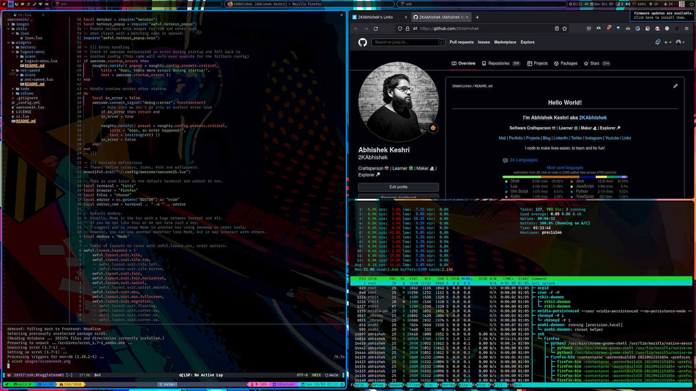

<div align = "center">

<h1><a href="https://2kabhishek.github.io/awesome2k">awesome2k</a></h1>

<a href="https://github.com/2KAbhishek/awesome2k/blob/main/LICENSE">
 </a>

<a href="https://github.com/2KAbhishek/awesome2k/graphs/contributors">
 </a>

<a href="https://github.com/2KAbhishek/awesome2k/stargazers">
</a>

<a href="https://github.com/2KAbhishek/awesome2k/network/members">
 </a>

<a href="https://github.com/2KAbhishek/awesome2k/watchers">
 </a>

<a href="https://github.com/2KAbhishek/awesome2k/pulse">
 </a>

<h3>Awesome Window Management 🪟🚀</h3>

<figure>
  
  <br/>
  <figcaption>awesome2k screenshot</figcaption>
</figure>

</div>

## What is this

My personalized configs for [awesome window manager](https://awesomewm.org/), optimized for an awesome experience.

### Widgets

Comes with a bunch of customized widgets:

- audio
- battery
- cpu
- disk
- network
- ram
- session
- text
- time
- todo

## Prerequisites

Before you begin, ensure you have met the following requirements:

- `awesome` the window manager itself
- `rofi` with [rofi2k](https://github.com/2kabhishek/rofi2k) my preferred launcher
- `compton/picom` compositor, for transparency
- `lxappearance` for gtk styling
- `copyq` for clipboard management
- `nitrogen` for wallpapers
- `light` for display brightness
- `amixer` for volume management
- `autorandr` for multiple displays
- `i3lock/i3lock-fancy` for lockscreen in session widget

```bash
# Arch
sudo pacman -S awesome picom lxappearance copyq nitrogen light amixer autorandr rofi

# Debian
sudo apt install awesome picom lxappearance copyq nitrogen light amixer autorandr rofi
```

## Setting up awesome2k

To get awesome2k, follow these steps:

```bash
git clone https://github.com/2kabhishek/awesome2k
ln -sfnv "$PWD/awesome2k" ~/.config/awesome
```

Add the following bash function to your `~/.bashrc` or `~/.zshrc` file to customize awesome and rofi accent colours

```bash
accent() {
    color="#1688f0"

    if [[ $1 == '#'* ]]; then
        color=$1
    elif [ -z "$1" ]; then
        color="#1688f0"
    else
        color="#$1"
    fi

    sed -i "s/local accent.*/local accent = '$color'/" ~/.config/awesome/awesome2k.lua
    sed -i "s/selected.*/selected:       $color;/" ~/.config/rofi/themes/shared/colors.rasi
    echo 'awesome.restart()' | awesome-client
}

# Example usage: accent #454ec5
```

You can also install [pastel](https://github.com/sharkdp/pastel) and combine it with the accent function to pick and set any colour on your screen as accent

```bash
accent $(pastel pick | pastel format hex)
```

## Using awesome2k

Hit `Super + /` key to view keyboard shortcuts.


## Inspiration

After using KDE for a long time with tiling support and struggling with config management, finally decided to switch to awesome.


## How it was built

awesome2k was built using `nvim`

Hit the ⭐ button if you found this useful.

## More Info

<div align="center">

<a href="https://github.com/2KAbhishek/awesome2k">Source</a> | <a href="https://2kabhishek.github.io/awesome2k">Website</a>

</div>
